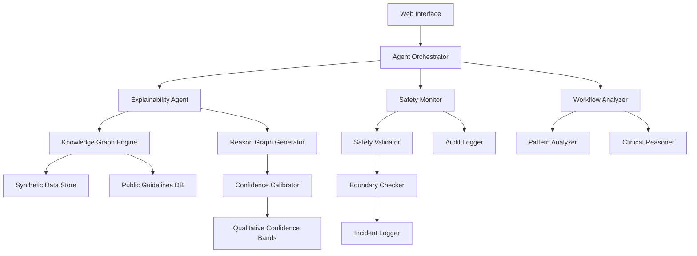

# Design Document: Explainability-First Clinical Intelligence (EFCI)

## Overview

The Explainability-First Clinical Intelligence (EFCI) system is designed as a multi-agent architecture that generates transparent explanations of clinical information, workflows, and documentation patterns. Built for the Kiro development platform, the system operates exclusively on synthetic and publicly available healthcare data to provide educational insights into clinical reasoning patterns **without crossing into medical advice territory**.

**CRITICAL DESIGN CONSTRAINTS:**
- **No Diagnosis**: System cannot and will not provide diagnostic conclusions
- **No Treatment**: System cannot and will not suggest treatments or therapies  
- **No Medical Advice**: System cannot and will not offer actionable medical guidance
- **Synthetic Data Only**: System processes ONLY synthetic or publicly available healthcare data
- **Educational Purpose**: Designed solely for learning and workflow understanding

The core innovation lies in generating **reason graphs** rather than traditional summaries - structured representations that show the logical connections, dependencies, and justifications behind clinical information elements. This approach enables healthcare professionals to understand not just what information exists, but why it exists and how it relates to other elements in the clinical workflow.

## Architecture

### High-Level Architecture

The EFCI system employs a **multi-agent orchestration pattern** where specialized agents collaborate to produce comprehensive explanations while maintaining strict safety boundaries. The architecture is designed around three core principles:

1. **Separation of Concerns**: Each agent has a specific responsibility (explanation generation, safety monitoring, workflow analysis)
2. **Fail-Safe Design**: Safety checks occur at multiple layers with the ability to halt processing
3. **Traceability**: Every explanation component can be traced back to its source material



### Agent Responsibilities

**Agent Orchestrator**
- Coordinates communication between specialized agents
- Manages workflow execution and error handling
- Implements conflict resolution when agents disagree
- Ensures proper sequencing of agent activities

**Explainability Agent**
- Generates initial reason graphs from clinical information
- Identifies relationships between clinical concepts
- Creates human-readable explanations with multiple detail levels
- Interfaces with knowledge graph engine for context

**Safety Monitor**
- Reviews all outputs before presentation to users
- Blocks content that could be interpreted as medical advice, diagnosis, or treatment
- Maintains audit trails of all safety decisions
- Implements incident reporting for boundary violations
- **Enforces absolute prohibition on diagnostic, therapeutic, and prognostic content**

**Workflow Analyzer**
- Identifies patterns in clinical documentation and processes
- Analyzes workflow dependencies and sequences
- Provides context for why specific information exists
- Maps clinical information to standard workflow patterns

## Components and Interfaces

### Core Components

**Knowledge Graph Engine**
- Maintains structured representation of clinical concepts and relationships
- Integrates ONLY synthetic data with public clinical guidelines - **NO REAL PATIENT DATA**
- Provides semantic search and relationship discovery capabilities
- Supports real-time updates when source materials change

**Reason Graph Generator**
- Converts clinical information into structured explanation graphs
- Implements graph algorithms for relationship discovery
- Generates multiple representation formats (visual, textual, hierarchical)
- Supports interactive exploration of explanation components

**Confidence Calibrator**
- Converts numerical confidence scores to qualitative bands
- Implements calibration algorithms to ensure accuracy alignment
- Tracks historical performance for continuous improvement
- Provides uncertainty quantification for explanation components

**Safety Validator**
- Implements rule-based and ML-based content filtering
- Maintains boundary detection for diagnostic/therapeutic content - **ABSOLUTE PROHIBITION**
- Provides real-time content analysis during generation
- Supports configurable safety policies for different environments
- **Blocks ANY content that could be construed as medical advice, diagnosis, or treatment**

### External Interfaces

**Web API Interface**
```typescript
interface EFCIRequest {
  clinicalInformation: ClinicalData;
  explanationLevel: 'overview' | 'detailed' | 'comprehensive';
  outputFormat: 'graph' | 'text' | 'interactive';
  confidenceThreshold: 'established' | 'common' | 'contextual';
}

interface EFCIResponse {
  reasonGraph: ReasonGraph;
  explanations: Explanation[];
  confidenceBands: ConfidenceBand[];
  sourceTraceability: SourceLink[];
  safetyStatus: SafetyValidation;
}
```

**Integration Interface**
- HL7 FHIR R4 compatibility for healthcare system integration
- RESTful APIs with OpenAPI 3.0 specification
- Webhook support for real-time notifications
- Bulk processing capabilities for large datasets

## Data Models

### Core Data Structures

**Reason Graph**
```typescript
interface ReasonGraph {
  nodes: ReasonNode[];
  edges: ReasonEdge[];
  metadata: GraphMetadata;
  confidenceMap: Map<string, ConfidenceBand>;
}

interface ReasonNode {
  id: string;
  type: 'concept' | 'relationship' | 'justification' | 'source';
  content: string;
  sourceLinks: SourceLink[];
  confidenceBand: ConfidenceBand;
  children: string[];
}

interface ReasonEdge {
  source: string;
  target: string;
  relationship: 'explains' | 'supports' | 'contradicts' | 'requires';
  strength: number;
  justification: string;
}
```

**Clinical Information Model**
```typescript
interface ClinicalData {
  type: 'workflow' | 'documentation' | 'guideline' | 'pattern';
  content: any; // Flexible structure for different data types
  metadata: {
    source: string;
    timestamp: Date;
    version: string;
    dataType: 'synthetic' | 'public';
  };
  validation: DataValidation;
}
```

**Confidence Band System**
```typescript
enum ConfidenceBand {
  ESTABLISHED_PRACTICE = 'Established Practice',
  COMMONLY_OBSERVED = 'Commonly Observed', 
  CONTEXT_DEPENDENT = 'Context Dependent',
  EMERGING_PATTERN = 'Emerging Pattern',
  INSUFFICIENT_DATA = 'Insufficient Data'
}

interface ConfidenceMetrics {
  band: ConfidenceBand;
  sourceCount: number;
  agreementLevel: number;
  historicalAccuracy: number;
  lastValidated: Date;
}
```

**Source Traceability Model**
```typescript
interface SourceLink {
  sourceId: string;
  sourceType: 'guideline' | 'standard' | 'research' | 'synthetic';
  title: string;
  section: string;
  url?: string;
  lastVerified: Date;
  relevanceScore: number;
}
```

### Data Flow Architecture

The system implements a **pipeline architecture** for data processing:

1. **Input Validation**: Verify data is synthetic or public, **REJECT ALL REAL PATIENT DATA**
2. **Knowledge Integration**: Map input to existing knowledge graph
3. **Reason Generation**: Create explanation graphs using multi-agent collaboration
4. **Safety Validation**: Check all outputs for boundary violations - **NO DIAGNOSIS/TREATMENT/ADVICE**
5. **Confidence Calibration**: Apply qualitative confidence bands
6. **Output Formatting**: Generate user-requested format with traceability

## Correctness Properties

These correctness properties define system invariants for explanation generation and safety enforcement. They explicitly exclude clinical decision-making, diagnosis, or treatment support.

*A property is a characteristic or behavior that should hold true across all valid executions of a system—essentially, a formal statement about what the system should do. Properties serve as the bridge between human-readable specifications and machine-verifiable correctness guarantees.*

Based on the prework analysis of acceptance criteria, the following consolidated properties ensure system correctness:

### CP-1: Multi-Agent Structural Integrity
For any system initialization, EFCI SHALL instantiate a minimum of three specialized agents (Explainability Agent, Safety Monitor, Workflow Analyzer), each with non-overlapping responsibilities, coordinated exclusively through the Agent Orchestrator.
**Validates: 1.1, 6.1–6.5**

### CP-2: Reason Graph Explanation Invariant
For any accepted clinical information input, the system SHALL generate a reason graph that explains relationships and justifications between information elements without introducing new clinical interpretations, diagnoses, or recommendations.
**Validates: 1.2, 1.4, 2.2**

### CP-3: Data Admissibility & Privacy Invariant
For any input data, the system SHALL:
- accept only synthetic or publicly available healthcare data,
- reject any data containing patient-identifiable information,
- apply privacy-preserving handling throughout processing.
**Validates: 1.3, 4.1–4.5**

### CP-4: Safety Boundary Enforcement Invariant
For any generated output, the Safety Monitor SHALL prevent the emission of diagnostic conclusions, treatment recommendations, prognostic predictions, or actionable medical advice, and SHALL block and log violations.
**Validates: 3.1–3.4**

### CP-5: Explainability Traceability Invariant
For any explanation or reasoning node, the system SHALL provide:
- logical connections between concepts,
- qualitative confidence indicators,
- complete traceability to originating public sources or synthetic data.
**Validates: 2.1, 2.3, 2.4, 11.1–11.4**

### CP-6: Confidence Calibration Invariant
For any confidence indicator presented, the system SHALL:
- use qualitative confidence bands (not probabilistic scores),
- reflect underlying source agreement and evidence strength,
- explicitly surface uncertainty when confidence is low.
**Validates: 5.1–5.5**

### CP-7: Multi-Level Explanation Availability
For any explanation request, the system SHALL support multiple levels of detail (overview → detailed → comprehensive), enabling progressive user exploration without changing underlying conclusions.
**Validates: 2.5, 7.3**

### CP-8: Performance & Load Safety Invariant
For any standard workload, the system SHALL:
- respond within defined latency bounds,
- support concurrent users as specified,
- degrade gracefully under load without violating safety or correctness guarantees.
**Validates: 8.1–8.3**

### CP-9: Auditability & Accountability Invariant
For any system action, the system SHALL generate immutable audit records covering:
- user interactions,
- explanation generation,
- safety interventions,
- system errors, with retention and reporting capabilities.
**Validates: 9.1–9.5**

### CP-10: Interoperability Safety Invariant
For any external integration, the system SHALL enforce the same data validation, safety boundaries, and traceability guarantees as internal workflows, regardless of interface or data format.
**Validates: 10.1–10.5**

### CP-11: Legal & Disclaimer Consistency
For any system output, the system SHALL include explicit disclaimers and SHALL maintain strict separation between explanation generation and clinical decision support.
**Validates: 1.5, 3.5**

### CP-12: Source Integrity Invariant
For any reasoning element, the system SHALL rely only on verified public or synthetic sources and SHALL flag explanations affected by source updates or deprecations.
**Validates: 11.2, 11.5**